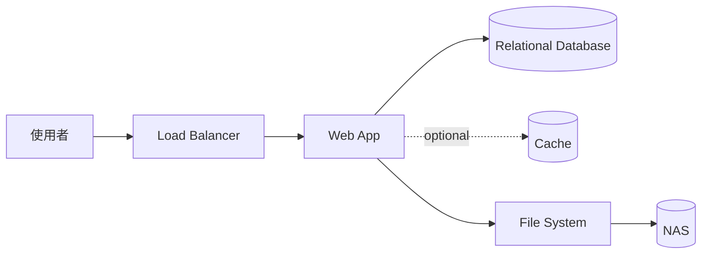

# 01. 單體式架構

單體式架構將使用者介面、API、業務邏輯與資料存取集中在同一個可部署單位。這是多數系統最容易開始的形式，也適合作為後續拆分與擴展的基準。

## 架構圖

## 適用場景

- 產品初期、需求仍快速變動
- 團隊規模小，需要快速交付
- 業務邊界尚未清楚
- 中小型應用或內部系統

## 特性

- 部署、測試與除錯流程相對簡單
- 程式碼與模組之間容易直接呼叫
- 所有功能通常共享同一個發布週期與執行環境
- 可以先採用模組化單體，保留未來拆分的邊界

## 優缺點

優點是開發與運維成本低、內部呼叫延遲小，且容易進行跨模組交易。缺點是程式碼規模變大後容易互相耦合，單一版本或資源問題也可能影響整個應用。

單體式不代表不能水平擴展；多個相同的應用實例也能支援高流量，只是擴展單位通常是整個應用程式。
