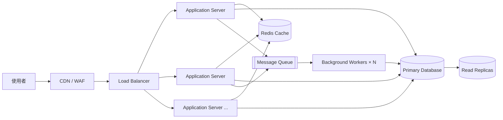

# 02. Cloud-Native 高併發架構

這張圖關注的是系統如何承受大量請求與流量尖峰，不限定採用單體或微服務。為了清楚區分微服務，本例使用可水平擴展的應用伺服器與背景 Worker，但不拆分業務服務。

## 架構圖

## 適用場景

- 流量大且具有尖峰，例如促銷、票務或熱門內容
- 讀取量遠高於寫入量
- 部分工作可以延後處理，例如寄信、通知、報表
- 需要透過快取與水平擴展降低單點壓力

## 主要設計

- CDN 快取靜態內容，WAF 負責基本安全防護
- Load Balancer 將請求分散到多個相同的應用實例
- Redis 減少重複查詢與資料庫讀取
- Read Replica 分散讀取流量
- Message Queue 將耗時工作改成非同步處理
- Worker 可依待處理任務數量獨立擴展

## 和微服務的差異

高併發架構解決的是「如何把流量撐住」，重點在快取、擴展、佇列與資料庫瓶頸。應用程式仍然可以是單體或模組化單體；它不要求依業務領域拆成多個服務。

## 主要代價

快取會帶來一致性問題，非同步處理需要處理重試與重複訊息，Read Replica 也可能產生讀寫延遲。系統需要搭配 rate limiting、timeout、circuit breaker 與 metrics 才能穩定運作。

