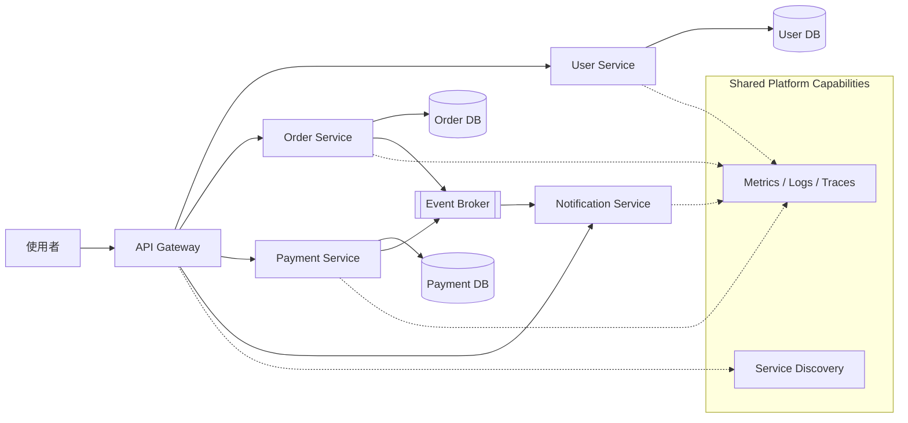

# 03. 微服務架構

微服務架構將系統依照業務能力拆成多個可獨立部署的服務。每個服務通常擁有自己的程式碼、部署生命週期與資料邊界，服務之間透過 API 或事件溝通。

## 架構圖

## 適用場景

- 系統規模大，業務領域與團隊邊界清楚
- 不同功能需要獨立部署或獨立擴展
- 多個團隊需要平行開發
- 不同服務有不同可靠性、效能或技術需求

## 主要設計

- API Gateway 統一處理路由、驗證、限流與對外入口
- 每個服務負責一個清楚的業務能力
- 服務盡量擁有自己的資料庫或資料擁有權
- 同步呼叫適合即時回應，事件則適合解耦與非同步流程
- Service Discovery、設定管理、Secrets 與可觀測性通常由平台提供

## 和高併發架構的差異

微服務解決的是「如何拆分與管理複雜系統」，重點在服務邊界、獨立部署與團隊自治。微服務不必然帶來更高效能，因為服務間網路呼叫反而會增加延遲與失敗點；高併發則可以透過一個水平擴展的單體應用來實現。

## 主要代價

系統會引入網路延遲、分散式交易、版本相容性、服務治理與更複雜的除錯流程。若業務邊界尚未成熟，過早拆分可能形成難以維護的 distributed monolith。

