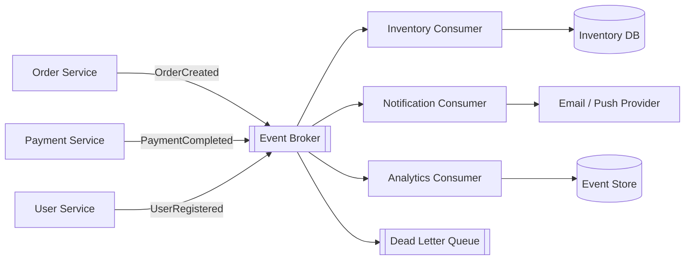

# 04. Event-Driven 架構

Event-Driven 架構以「事件」作為元件之間的溝通方式。Producer 發布已發生的事，Broker 負責保存與傳遞，Consumer 依需求訂閱並處理事件，彼此不需要直接同步呼叫。

## 架構圖

## 適用場景

- 多個功能需要回應同一個業務事件
- 工作可以非同步執行
- 需要降低服務之間的直接耦合
- 訂單、付款、庫存、通知與分析等流程

## 主要設計

- 事件描述「已經發生的事」，例如 `OrderCreated`
- Broker 提供持久化、Consumer Group、重試或重播能力
- Consumer 應具備冪等性，避免重複投遞造成重複操作
- 失敗事件可送入 Dead Letter Queue，供後續排查與補處理
- 事件 Schema 需要版本管理，避免 Producer 與 Consumer 互相破壞

## 優缺點

優點是解耦、可擴充，新增 Consumer 通常不需要修改原始 Producer。缺點是資料一致性通常變成 eventual consistency，流程追蹤與錯誤處理也比同步呼叫複雜。

