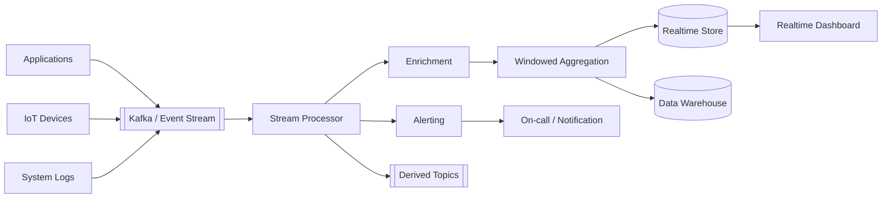

# 05. Streaming 架構

Streaming 架構持續處理不斷流入的資料，而不是等到整批資料收集完成後才執行。核心是低延遲接收、即時轉換、聚合與輸出。

## 架構圖

## 適用場景

- 即時監控、告警與儀表板
- 點擊流、交易流或 IoT 資料
- 即時風控、推薦或異常偵測
- 需要秒級或分鐘級反應的資料處理

## 主要設計

- Event Stream 提供可持續追加、分區與消費位置管理
- Stream Processor 負責轉換、過濾、Join 與聚合
- Window 定義時間範圍，例如 tumbling、sliding 或 session window
- Realtime Store 支援低延遲查詢，Data Warehouse 支援長期分析
- 需要處理事件順序、重複、遲到資料與 checkpoint

## 和 Event-Driven 的差異

Event-Driven 著重「服務之間用事件解耦」；Streaming 著重「持續資料流的即時處理」。兩者可以使用相同的 Broker，但 Streaming 通常更重視順序、時間視窗、吞吐量與處理延遲。

