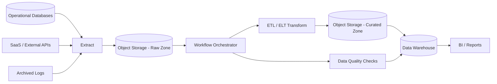

# 06. Batch Data Pipeline

Batch Data Pipeline 以固定時間或資料量為單位，週期性地擷取、轉換與載入資料。它通常追求完整性、可重跑與大批量處理能力，而不是即時回應。

## 架構圖

## 適用場景

- 每日或每小時報表
- 財務結算、對帳與資料匯總
- 歷史資料分析與資料倉儲載入
- 不需要即時結果，或即時處理成本過高的工作

## 主要設計

- Raw Zone 保留原始資料，方便稽核與重新處理
- Transform 將資料清理、標準化並轉成分析模型
- Orchestrator 管理依賴、排程、重試與失敗通知
- Data Quality Checks 驗證筆數、Schema、唯一性與完整性
- Pipeline 應支援 idempotency 與增量載入，避免每次重算全部資料

## 和 Streaming 的差異

Batch 以批次與排程為核心，通常延遲較高但流程較容易重跑與稽核；Streaming 持續處理事件，延遲較低但需要處理順序、遲到資料與長時間執行狀態。實務上常以 Lambda 或 Lakehouse 形式並存。

