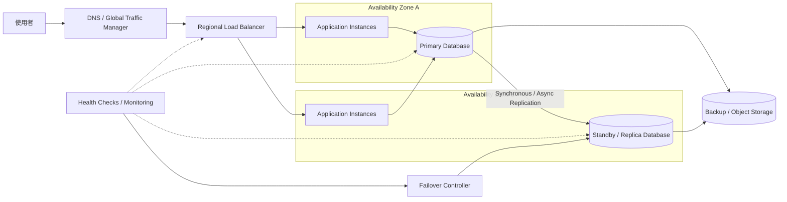

# 07. 高可用性架構

高可用性架構透過冗餘、故障轉移與資料備份，降低單一元件或單一可用區故障造成的服務中斷。重點不是完全不故障，而是故障時仍能提供服務，並在可接受時間內恢復。

## 架構圖

## 適用場景

- 服務中斷會造成重大業務或財務影響
- 需要跨 Availability Zone 或資料中心部署
- 需要明確定義 RTO 與 RPO
- 需要自動故障轉移與災難復原流程

## 主要設計

- 應用程式與 Load Balancer 避免單一實例
- 將實例分散到不同 Availability Zone
- 資料庫使用同步或非同步複寫與備援節點
- Health Check 判斷元件是否可服務，不只檢查程序是否存活
- Backup 與跨區域複製支援資料復原
- 定期進行 failover、restore 與 disaster recovery 演練

## 主要取捨

冗餘節點與跨區域複製會增加成本與系統複雜度。同步複寫通常能降低資料遺失，但可能增加寫入延遲；非同步複寫效能較好，故障時則可能遺失最近尚未複製的資料。

