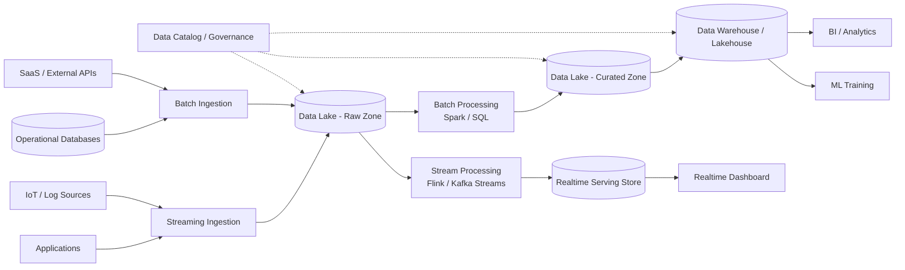

# 08. 大數據架構

大數據架構處理大量、快速且多樣的資料。常見做法是將原始資料集中保存於 Data Lake 或 Lakehouse，再透過批次與串流計算產生可供分析、報表與機器學習使用的資料集。

## 架構圖

## 適用場景

- 大量交易、點擊流、日誌或 IoT 資料分析
- 跨來源資料整合與長期保存
- BI 報表、資料探勘與機器學習
- 同時需要批次分析與即時查詢

## 主要設計

- Ingestion 層負責批次匯入與即時資料流
- Raw Zone 保留不可變的原始資料，支援稽核與重算
- Processing 層執行清理、轉換、Join、聚合與特徵處理
- Curated Zone 保存已整理、可重複使用的資料
- Warehouse 或 Lakehouse 提供分析查詢，Realtime Store 提供低延遲讀取
- Catalog、Schema、權限、加密與資料品質檢查負責治理

## 和 Streaming 的差異

大數據架構是較大的資料平台範疇，可以同時包含 Batch 與 Streaming。Streaming 只聚焦於持續流入資料的即時處理；大數據架構還需要考慮資料湖、歷史保存、治理、分析與 ML 工作負載。

## Cloud Native 關聯

適合 cloud native。物件儲存、Managed Kafka、Serverless Data Warehouse、彈性計算與 IaC 能讓資料平台依資料量彈性擴展。不過「大數據」本身是資料規模與處理方式，不等於 cloud native。

