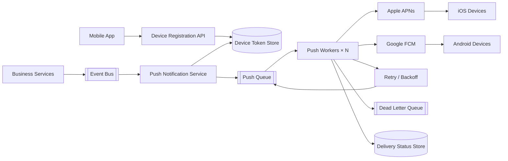

# 09. 手機推播架構

手機推播架構負責將應用程式事件轉換成通知，並透過 Apple Push Notification service（APNs）或 Firebase Cloud Messaging（FCM）送到使用者裝置。推播請求通常採用非同步處理，避免第三方服務延遲阻塞主要業務流程。

## 架構圖

## 適用場景

- 訂單狀態、付款結果與物流通知
- 聊天訊息、社交互動與提醒
- 行銷活動、分群推播與排程通知
- 需要大量發送且不能阻塞主要交易流程

## 主要設計

- 裝置註冊 API 保存 token、平台、App 版本與使用者偏好
- 業務服務只發布事件，不直接呼叫 APNs 或 FCM
- Push Service 負責模板、語系、分群與通知內容組裝
- Queue 與 Worker 支援限流、水平擴展、重試與 backoff
- 失效 token 應從 Token Store 清理
- Delivery Status Store 保存送達、失敗與重試狀態

## 重要注意事項

推播送達不是絕對可靠，也不應作為唯一的業務狀態來源。通知內容應避免放置敏感資料，真正的詳細內容應由 App 開啟後透過 API 重新取得。Consumer 與推播 Worker 必須具備冪等性，以處理重複事件。

## Cloud Native 關聯

適合 cloud native。事件匯流排、Queue、Serverless Worker、Managed Database 與可觀測性服務能支援彈性流量與非同步處理；但 APNs、FCM 等第三方平台仍是外部依賴，需要 timeout、retry、rate limit 與監控。

