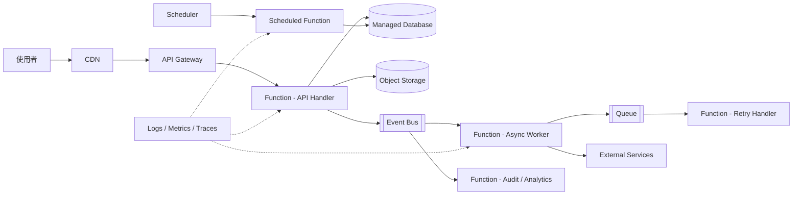

# 10. Serverless 架構

Serverless 架構將伺服器配置、容量管理與部分基礎設施維運交給雲端供應商。應用程式通常由 Functions、Managed Services 與事件觸發器組成，依請求量或事件量自動擴展。

## 架構圖

## 適用場景

- API、Webhook 與事件觸發的短時間工作
- 流量不固定或有明顯尖峰的服務
- 排程任務、檔案處理、通知與資料轉換
- 團隊希望降低伺服器與叢集維運負擔

## 主要設計

- API Gateway 提供路由、驗證、限流與 request timeout
- Function 以單一責任處理請求或事件
- Event Bus 與 Queue 用於解耦、非同步處理與重試
- Object Storage、Managed Database 等服務負責持久化
- Logs、Metrics、Traces 用於追蹤短生命週期與分散式執行

## 主要取捨

優點是按用量付費、可快速擴展、基礎設施管理較少。代價包括 cold start、執行時間與記憶體限制、平台綁定、分散式除錯，以及長時間或高穩定負載下可能不如長駐服務具成本效益。

Serverless 不代表沒有伺服器，而是伺服器由平台管理；應用程式仍需處理權限、網路、資料一致性、重試與安全性。

## Cloud Native 關聯

高度適合 cloud native。Serverless 強調按需資源、事件驅動、Managed Services 與自動擴展，是 cloud-native execution model 的一種。不過不必為了 cloud native 而將所有工作都改成 Function，工作負載與成本模型仍需先評估。

