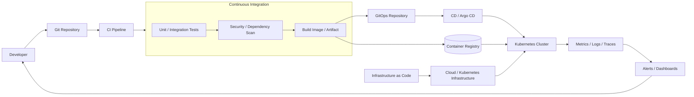

# 11. DevOps 架構

DevOps 嚴格來說不是單一應用程式架構，而是結合文化、流程與工具的軟體交付與運維方法。這張圖用平台與流程視角，呈現從程式碼提交到部署、監控與回饋的閉環。

## 架構圖

## 適用場景

- 需要快速、可重複且可追蹤地交付軟體
- 使用 CI/CD、容器、Kubernetes 或 GitOps 的團隊
- 需要將監控、告警與生產回饋納入開發流程
- 希望降低手動部署與環境差異

## 主要設計

- Git 作為程式碼、設定與版本變更的來源
- CI 負責測試、靜態分析、安全掃描與 artifact 建置
- Container Registry 保存不可變的映像檔或套件
- CD 將已驗證的版本部署到環境
- GitOps 以 Git 中的 desired state 管理 Kubernetes 部署
- Observability 將 metrics、logs、traces 與告警回饋給團隊
- IaC 以程式碼建立與修改雲端及叢集資源

## 主要取捨

自動化能降低人工作業與部署風險，但 pipeline、權限、Secrets、環境 promotion 與 rollback 也需要治理。DevOps 不只是安裝 CI/CD 工具；還需要測試責任、值班流程、變更管理與持續改善。

## Cloud Native 關聯

非常適合放在 cloud-native 整理中，但它應被標示為「交付與運維架構／流程」，而不是應用程式架構。容器、Kubernetes、GitOps、IaC 與可觀測性是常見的 cloud-native DevOps 實作，但 DevOps 方法本身也能應用在非 cloud-native 系統。

