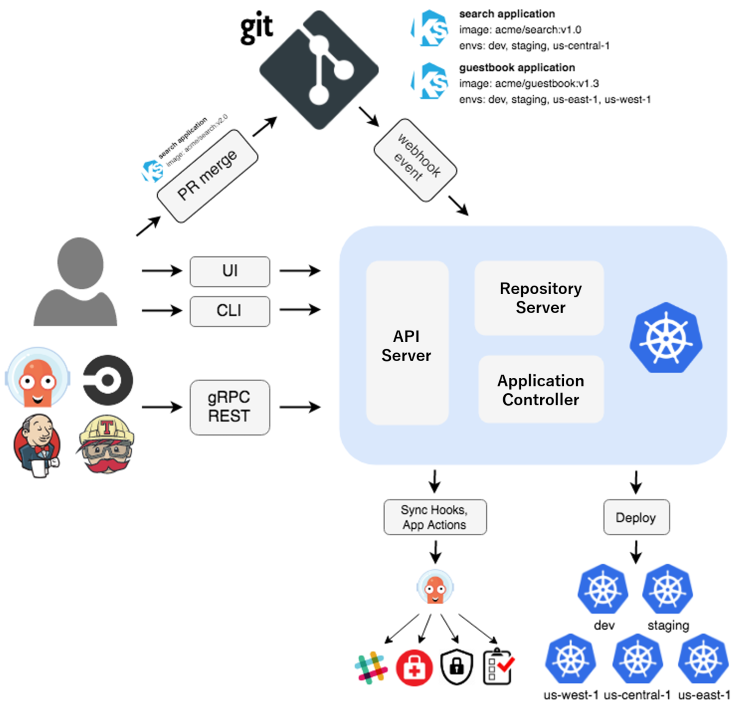

# Argo CD

## 一句話定位

Argo CD 是 Kubernetes 的 declarative GitOps continuous delivery tool，將 Git repository 的 desired state 與 cluster live state 做比對並同步。

## 官方文件

- [Argo CD official site](https://argo-cd.readthedocs.io/en/stable/)
- [Getting Started](https://argo-cd.readthedocs.io/en/stable/getting_started/)
- [Declarative Setup](https://argo-cd.readthedocs.io/en/stable/operator-manual/declarative-setup/)

## 它解決什麼問題

傳統部署常由 operator 在 terminal 直接執行 `kubectl apply`，但 cluster 最後為什麼是這個狀態、誰改的、如何恢復，可能不容易追蹤。Argo CD 將 Git commit 當成可審查的 desired state，持續比較並回報差異。

## 它和 Jenkins、GitLab 的角色差異

Argo CD、Jenkins 和 GitLab 不完全是相同角色：

| 工具 | 主要角色 | 主要工作 |
|---|---|---|
| Jenkins | CI/CD 平台 | build、test，以及依 pipeline 執行部署 |
| GitLab CI/CD | CI/CD 平台 | 整合 Git repository、Merge Request、build、test、deploy |
| Argo CD | Kubernetes continuous delivery / GitOps 工具 | 持續讓 Kubernetes 的 live state 符合 Git 裡的 desired state |

Argo CD 通常不是 Jenkins 或 GitLab CI 的直接替代品，而是補足「建置完成後，如何持續且可稽核地管理 Kubernetes 部署」這個缺口。

常見的分工如下：

```text
GitLab / GitHub
    -> GitLab CI 或 Jenkins：build、test、建立 container image
    -> 更新 Git 裡的 Kubernetes manifest
    -> Argo CD：從 Git 讀取設定並同步到 Kubernetes
```

一句話記憶：

> Jenkins / GitLab CI 負責「把東西做出來」；Argo CD 負責「確保 Kubernetes 一直是 Git 定義的樣子」。

## Argo CD 補足的缺口

- **避免環境漂移（configuration drift）**：有人直接修改 cluster 時，Argo CD 能偵測 live state 與 Git 的差異。
- **Git 作為唯一真相來源**：部署版本與設定有 commit 紀錄，可以 review、稽核與追蹤。
- **持續同步而非只部署一次**：Argo CD 會持續 reconcile，確保實際狀態回到 desired state。
- **降低 CI 對 production cluster 的權限**：CI 可以只負責更新 Git，不必直接操作 production cluster。
- **容易回滾**：回退 Git commit，再由 Argo CD 同步回先前版本。
- **支援多環境、多叢集管理**：可以讓不同 Application 對應 dev、staging、production 或不同 Kubernetes cluster。

## 監控與資安的邊界

Argo CD 確實有一些監控與資安治理的意味，但它監控的核心是**部署狀態與設定一致性**，不是完整的監控或資安平台。

它可以觀察或協助：

- Git desired state 與 Kubernetes live state 是否一致。
- Application 是否 `Synced`、`OutOfSync`、`Healthy`。
- 部署變更的 Git commit 與操作紀錄。
- 透過 RBAC 限制誰可以管理哪些 Application 或環境。
- 搭配 policy、image signing、漏洞掃描等工具，阻擋不合規的部署。

它本身不是：

- Prometheus / Grafana 這類效能與系統監控工具。
- SIEM、SOC 或 runtime security 工具。
- SAST、DAST 或 container vulnerability scanner。

因此，Argo CD 的資安價值主要來自 **Git 稽核、權限治理、減少直接修改 production，以及維持部署設定一致性**。

## 容易混淆的 Argo 元件

本文件討論的是 **Argo CD**。Argo 是一組 Kubernetes 原生工具，不是只有 Argo CD：

- **Argo CD**：GitOps continuous delivery，負責 Kubernetes 部署與狀態同步。
- **Argo Workflows**：Kubernetes 工作流引擎，可執行多步驟 pipeline 或批次任務。
- **Argo Events**：事件觸發器，監聽 webhook、Git 或訊息事件後觸發工作流。

所以「Argo 可以取代 Jenkins 嗎？」沒有單一答案：Argo CD 主要取代的是部署管理部分；Argo Workflows 才可能和 Jenkins pipeline 的部分工作重疊。

## Architecture



## 在本專案的價值

`argocd/application.yaml` 定義：

- source repo：這個 Git repository。
- source path：`app/hello`。
- target：目前 kind cluster 的 `demo` namespace。
- sync policy：手動 sync，方便觀察 `OutOfSync` 與 `Synced` 轉換。

實際流程：

```text
修改 app/hello manifest
  -> git commit / push
  -> Argo CD 偵測 OutOfSync
  -> 手動 Sync
  -> Kubernetes resource 更新
  -> Application 變成 Synced / Healthy
```

## 這裡要觀察的狀態

| 狀態 | 意義 |
|---|---|
| `Synced` | live state 與 Git desired state 一致 |
| `OutOfSync` | cluster 與 Git 有差異，需要 sync 或判斷是否為 drift |
| `Healthy` | Argo CD 判斷 resource health 正常 |

## 它與 Kustomize、kubectl 的關係

- Kustomize：render `app/hello` 的 manifests。
- Argo CD：從 Git 取得 source、比較 state、協調 sync。
- kubectl：安裝 Argo CD、建立 Application，以及直接觀察 cluster。

三者分工不同；`kubectl apply -k app/hello` 是 fallback 或初次驗證，不是 GitOps demo 的主要路徑。

## 本次 lab 的邊界

不做 automated sync policy、multi-cluster、SSO/RBAC、ApplicationSet、progressive delivery 或 rollback pipeline。這次只需要完成一個 Application 的 sync、drift 觀察與 Git revert 恢復。
